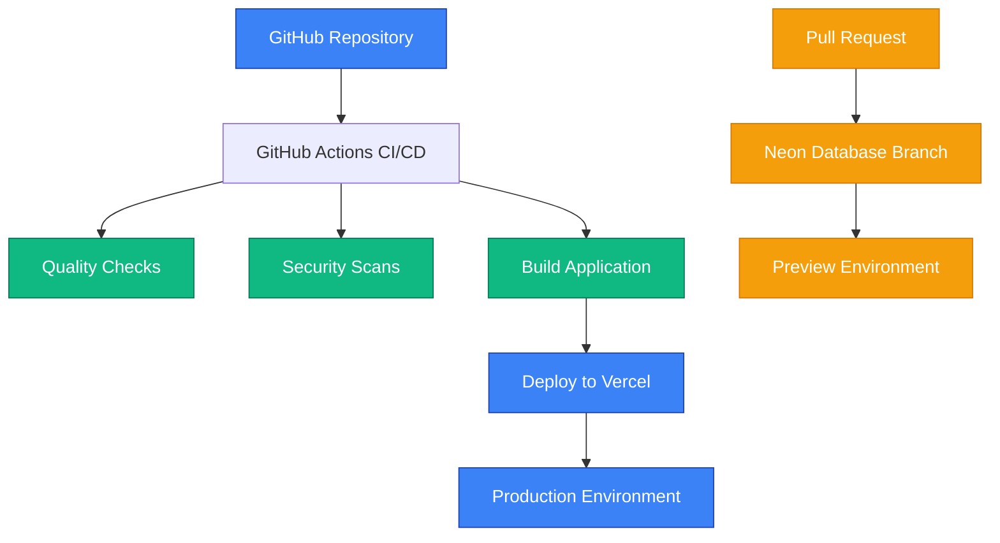

# Perfly Documentation

Welcome to the **Perfly** documentation! This folder contains all the essential guides for understanding, developing, and deploying the Perfly web performance testing platform.

## 📚 Documentation Overview

### Core Documentation

| Document | Purpose | When to Read |
|----------|---------|--------------|
| **[PROJECT_OVERVIEW.md](PROJECT_OVERVIEW.md)** | Complete project overview and architecture | First time setup, understanding the system |
| **[plan.md](plan.md)** | Development roadmap and technical specifications | Planning features, understanding tech stack |
| **[DEPLOYMENT_SETUP.md](DEPLOYMENT_SETUP.md)** | Step-by-step Vercel deployment guide | Setting up production deployment |
| **[WORKFLOW-ARCHITECTURE.md](WORKFLOW-ARCHITECTURE.md)** | CI/CD system documentation | Understanding the simplified GitHub Actions workflows |

## 🚀 Quick Start

### New to Perfly?
1. **Start with** [PROJECT_OVERVIEW.md](PROJECT_OVERVIEW.md) - Get the big picture
2. **Then read** [plan.md](plan.md) - Understand the technical details
3. **Follow** [DEPLOYMENT_SETUP.md](DEPLOYMENT_SETUP.md) - Deploy to production

### Setting Up Development?
1. **Clone the repository** and install dependencies with `bun install`
2. **Configure environment** variables (see PROJECT_OVERVIEW.md)
3. **Set up database** with `bun run db:migrate`
4. **Start development** with `bun run dev`

### Deploying to Production?
1. **Follow** [DEPLOYMENT_SETUP.md](DEPLOYMENT_SETUP.md) for complete setup
2. **Configure GitHub secrets** for automated deployments
3. **Set up Neon database** with preview branching
4. **Deploy via GitHub Actions** - automatic on push to main

## 🎯 Project Status

### ✅ **Completed Features**
- **Modern Stack**: Next.js 15, Bun, TypeScript, Tailwind CSS
- **Database**: Neon PostgreSQL with Drizzle ORM
- **Authentication**: Better Auth with GitHub OAuth
- **UI Components**: shadcn/ui component library
- **CI/CD**: Simplified GitHub Actions workflows
- **Deployment**: Vercel with automatic deployments

### 🚧 **In Development**
- **Performance Testing**: WebPageTest API integration
- **Analysis**: Rule-based performance insights
- **Results Visualization**: Core Web Vitals and metrics display
- **User Dashboard**: Test history and management

### 📋 **Planned Features**
- **Test Comparison**: Side-by-side performance analysis
- **Historical Trends**: Performance tracking over time
- **Email Notifications**: Test completion alerts
- **API Access**: Programmatic testing capabilities

## 🛠️ Technology Stack

### Frontend
- **Framework**: Next.js 15 with App Router
- **Runtime**: Bun for fast development
- **Styling**: Tailwind CSS + shadcn/ui
- **Language**: TypeScript throughout

### Backend
- **Database**: Neon PostgreSQL (serverless)
- **ORM**: Drizzle for type-safe queries
- **Authentication**: Better Auth
 
- **Email**: Resend

### Infrastructure
- **Hosting**: Vercel (zero-config deployment)
- **CI/CD**: GitHub Actions (simplified workflows)
- **Database Branching**: Neon for preview environments
- **Monitoring**: Built-in Vercel analytics

## 🔧 Development Commands

```bash
# Development
bun run dev              # Start development server
bun run build            # Build for production
bun run start            # Start production server

# Database
bun run db:generate      # Generate migrations
bun run db:migrate       # Apply migrations
bun run db:push          # Push schema changes

# Quality
bun run lint             # Typecheck + lint (Ultracite)
bun run format           # Format code (Ultracite)
```

## 🚀 Deployment Architecture



## 🎯 Core Features

### 🔍 **Performance Testing**
Test any website's performance with:
- **Core Web Vitals**: LCP, CLS, FCP, TTI measurements
- **Multiple Locations**: Global test server locations
- **Connection Types**: Various network conditions simulation
- **Detailed Analysis**: Resource waterfalls and timing breakdowns

### 🧠 **AI-Powered Insights**
Get intelligent performance analysis:
- **Plain Language Explanations**: Technical metrics made simple
- **Bottleneck Identification**: Prioritized performance issues
- **Optimization Recommendations**: Actionable improvement suggestions
- **Performance Scoring**: Overall website performance rating

### 👥 **User Experience**
Modern, accessible interface:
- **GitHub Authentication**: Quick sign-in with OAuth
- **Personal Dashboard**: Test history and management
- **Real-time Updates**: Live test progress tracking
- **Mobile Responsive**: Works great on all devices

## 📞 Getting Help

### Common Issues
- **Environment Variables**: Check [DEPLOYMENT_SETUP.md](DEPLOYMENT_SETUP.md)
- **Database Connection**: Verify Neon configuration
- **Build Errors**: Run `bun run lint` for quality issues
- **Deployment**: Check GitHub Actions logs

### Resources
- **GitHub Issues**: Report bugs and request features
- **Discussions**: Ask questions and share ideas
- **Documentation**: This folder has comprehensive guides
- **Code Examples**: Check the source code for implementation details

## 🎨 Design Principles

### **KISS (Keep It Simple, Stupid)**
- **Simple Architecture**: 4 focused GitHub Actions workflows
- **Clear Structure**: Organized codebase with logical separation
- **Easy Maintenance**: No over-engineering or complex abstractions

### **Developer Experience**
- **Fast Setup**: Get running in minutes with Bun
- **Type Safety**: Full TypeScript coverage
- **Quality Tools**: Automated linting, formatting, and testing
- **Clear Documentation**: Everything you need is documented

### **User-Centered Design**
- **Accessibility**: WCAG compliant with screen reader support
- **Performance**: Optimized for fast loading and interaction
- **Mobile-First**: Responsive design that works everywhere
- **Intuitive Interface**: Clear navigation and user flows

---

**Happy coding! 🚀**

*For specific setup questions, start with [PROJECT_OVERVIEW.md](PROJECT_OVERVIEW.md) or [DEPLOYMENT_SETUP.md](DEPLOYMENT_SETUP.md).*
